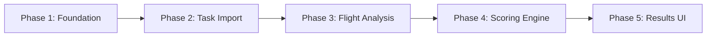

# Competition Classification Port: FS to Trackdownloader

This documentation outlines the comprehensive plan for porting competition classification functionality from the FS C# codebase to the trackdownloader Electron/React/TypeScript application.

## Overview

The goal is to enable trackdownloader to:
1. Import competition task definitions (XCTrack .xctsk format)
2. Analyze IGC flight tracks against task definitions
3. Score competitions using GAP2023/GAP2025 formulas
4. Display and export results

## Quick Links

### Architecture
- [Dependency Graph](./architecture/dependency-graph.md) - Visual module dependencies
- [Data Flow](./architecture/data-flow.md) - How data moves through the system
- [IPC Channels](./architecture/ipc-channels.md) - Electron IPC communication

### Implementation Phases
- [Phase 1: Foundation](./phases/phase-1-foundation.md) - TypeScript types, storage, IPC
- [Phase 2: Task Import](./phases/phase-2-task-import.md) - XCTrack .xctsk parsing
- [Phase 3: Flight Analysis](./phases/phase-3-flight-analysis.md) - IGC track analysis
- [Phase 4: Scoring Engine](./phases/phase-4-scoring-engine.md) - GAP scoring formulas
- [Phase 5: Results & UI](./phases/phase-5-results-ui.md) - React components

### Reference
- [TypeScript Interfaces](./reference/typescript-interfaces.md) - All type definitions
- [Scoring Formulas](./reference/scoring-formulas.md) - Mathematical formulas
- [GAP2023 vs GAP2025](./reference/gap2023-vs-gap2025.md) - Version differences
- [FS Code Mapping](./reference/fs-code-mapping.md) - C# to TypeScript mapping

### Examples & Testing
- [XCTrack Format](./examples/xctsk-format.md) - Task file format documentation
- [Scoring Calculation](./examples/scoring-calculation.md) - Step-by-step example
- [Leading Coefficient](./examples/leading-coefficient.md) - LC calculation examples
- [Test Data](./test-data/) - Sample files for validation
- [Validation Notes](./test-data/validation-notes.md) - FS comparison guide

---

## Technology Stack

| Layer | Technology |
|-------|------------|
| Desktop Framework | Electron 31.2.1 |
| UI Framework | React 18.2 |
| Language | TypeScript 5.3.3 |
| State Management | React Context API |
| Styling | Tailwind CSS |
| IPC | Electron IPC with preload bridges |

---

## Source Codebases

### FS (Source)
```
/Users/sergio/storo/FS/
├── FsSfGAP/
│   ├── GAP.cs                    # Main scoring engine (2,369 lines)
│   └── LeadingCalculator/        # LC algorithms
├── FsTaskFlight/
│   └── Flight.cs                 # Flight analysis (1,464 lines)
├── FsFsdb/
│   ├── ScoreFormulaParameter.cs  # Scoring parameters (778 lines)
│   ├── FsTaskDefinition.cs       # Task definitions
│   └── TaskParticipant.cs        # Participant data
└── FsUtil/XCTrack/
    └── Task_v1.cs                # XCTrack parser
```

### Trackdownloader (Target)
```
/Users/sergio/storo/trackdownloader/
├── src/main/
│   ├── lib/igc-parser.ts         # Existing IGC parser (extend)
│   ├── tracks/                   # Track operations (pattern to follow)
│   └── scoring/                  # NEW: Scoring engine
└── src/renderer/
    ├── context/                  # State management (pattern to follow)
    └── components/               # UI components
```

---

## Implementation Strategy

### Hybrid Approach

| Component | Strategy | Rationale |
|-----------|----------|-----------|
| Mathematical Formulas | Direct Translation | Pure math, 1:1 portable |
| Validity Calculations | Direct Translation | Polynomial formulas |
| Weight Distribution | Direct Translation | Pure math |
| Flight Processing | Rewrite | C# XML coupling |
| Geo Utilities | Rewrite | TypeScript-native |
| IGC Analysis | Extend Existing | Build on parser |
| Storage Layer | New Implementation | Different architecture |
| UI Components | New Implementation | React patterns |

### Estimated Effort

| Component | C# Lines | TypeScript Est. |
|-----------|----------|-----------------|
| Validity Calculations | ~100 | ~80 |
| Weight Distribution | ~90 | ~70 |
| Point Calculations | ~180 | ~140 |
| Leading Coefficient | ~200 | ~150 |
| Turnpoint Detection | ~300 | ~250 |
| Distance Calculation | ~200 | ~180 |
| Geo Utilities | ~400 | ~200 |
| **Total** | ~1470 | ~1070 |

---

## Scoring System Overview

The GAP (Gliding and Paragliding) scoring system calculates points based on 5 components:

```
Total Points = (Distance + Time + Arrival + Departure + Leading) × Day Quality
```

### Day Quality (0-1)
```
Day Quality = Time Validity × Launch Validity × Distance Validity × Stop Validity
```

### Point Distribution (sums to 1000 × Day Quality)
- **Distance Points**: 50-75% (based on distance flown)
- **Time Points**: 25-50% (based on speed in goal)
- **Leading Points**: 5-25% (reward for leading the race)
- **Arrival Points**: 0-20% (optional, based on finish order/time)
- **Departure Points**: 0-20% (alternative to leading)

---

## Key Formulas

### Time Validity
```typescript
tvRaw = bestTime > 0
  ? min(bestTime / nomTime, 1)
  : min(bestDist / nomDist, 1);

timeValidity = -0.271 + 2.912×tvRaw - 2.098×tvRaw² + 0.457×tvRaw³
```

### Launch Validity
```typescript
lvRaw = min(1.0, pilotsFlying / (pilotsPresent × nomLaunch));
launchValidity = 0.028×lvRaw + 2.917×lvRaw² - 1.944×lvRaw³
```

### Time Points
```typescript
timeFraction = 1 - ((time - bestTime) / √bestTime)^(5/6)
timePoints = timeFraction × availableTimePoints
```

### Leading Points
```typescript
leadingFraction = 1 - ((lc - smallestLc) / √smallestLc)^(2/3)
leadingPoints = leadingFraction × availableLeadingPoints
```

---

## Phase Dependencies



---

## Getting Started

1. Read the [Architecture Overview](./architecture/dependency-graph.md)
2. Review [TypeScript Interfaces](./reference/typescript-interfaces.md)
3. Follow phases in order, starting with [Phase 1](./phases/phase-1-foundation.md)
4. Use [Test Data](./test-data/) to validate implementation
5. Compare results against FS using [Validation Notes](./test-data/validation-notes.md)

---

## User Requirements

| Requirement | Choice |
|-------------|--------|
| Scoring Formulas | GAP2023 + GAP2025 |
| Task Format | XCTrack .xctsk JSON |
| Storage | File-based JSON/XML |
| Priority | Task import + basic scoring first |
