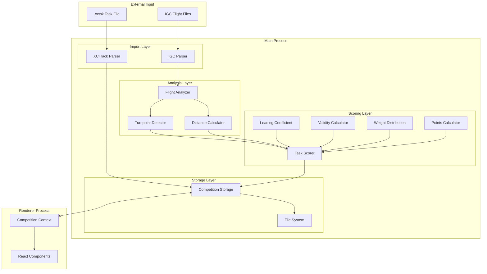
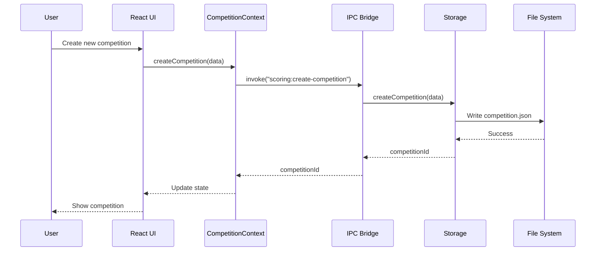
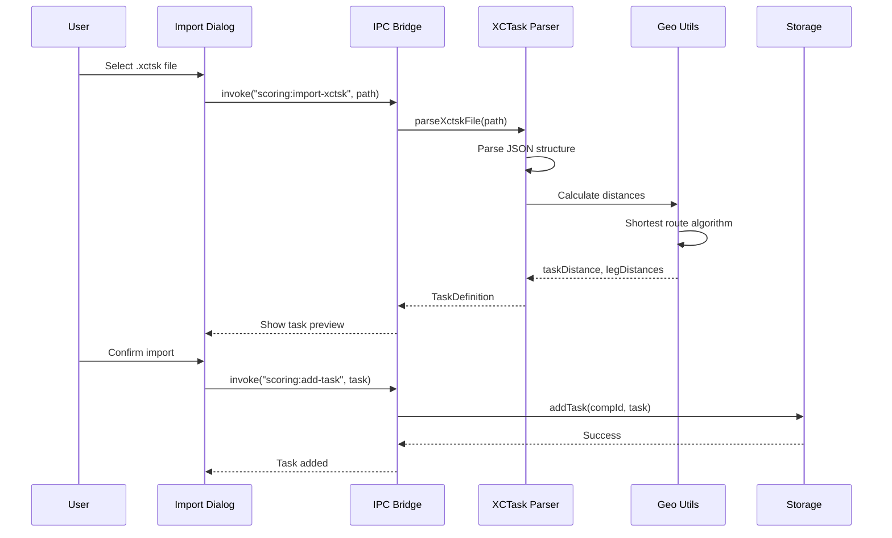
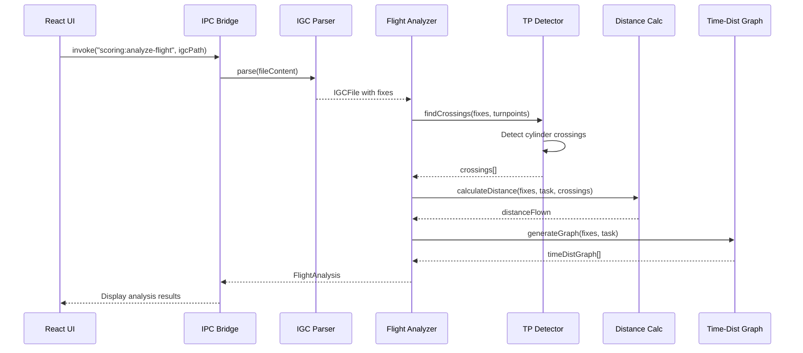
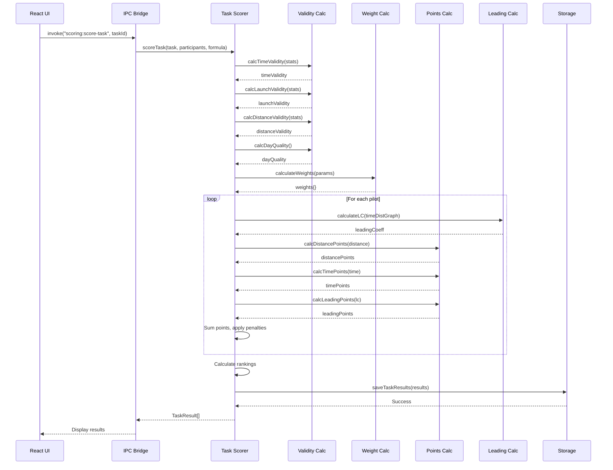
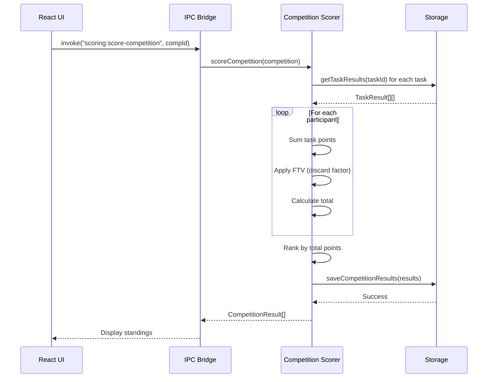
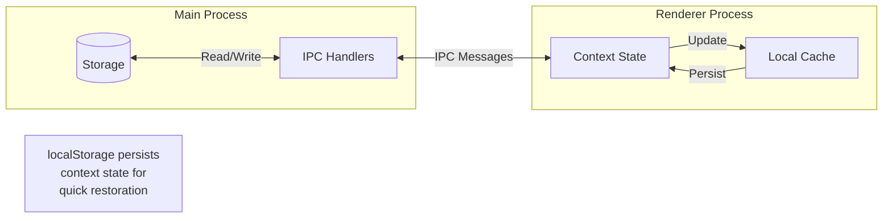
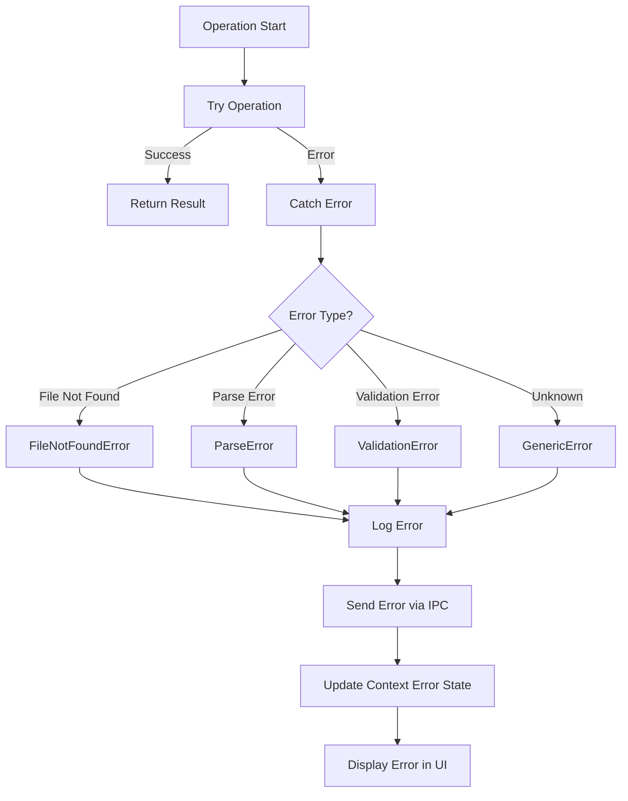
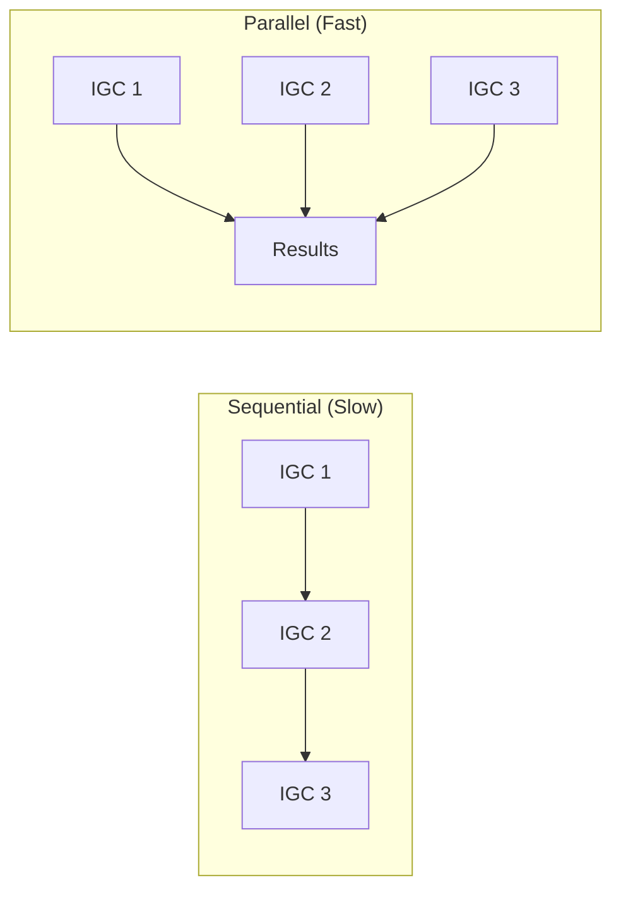

# Data Flow

This document describes how data flows through the competition classification system.

## Overview



## Detailed Data Flows

### 1. Competition Creation Flow



### 2. Task Import Flow



### 3. Flight Analysis Flow



### 4. Task Scoring Flow



### 5. Competition Results Flow



## Data Transformation Pipeline

### XCTrack to TaskDefinition

```
.xctsk JSON                    TaskDefinition
┌────────────────────┐         ┌────────────────────┐
│ taskType: "RACE"   │         │ taskType: "Race"   │
│ turnpoints: [      │         │ turnpoints: [      │
│   { type, radius,  │ ──────► │   { id, geopoint,  │
│     waypoint: {    │         │     radius, open,  │
│       name, lat,   │         │     close, type }  │
│       lon, alt }}  │         │ ]                  │
│ ]                  │         │ startGates: [...]  │
│ sss: { timeGates } │         │ taskDistance: 45.2 │
│ goal: { type }     │         │ ssIndex: 1         │
└────────────────────┘         │ esIndex: 4         │
                               └────────────────────┘
```

### IGC to FlightAnalysis

```
IGCFile (from igc-parser)      FlightAnalysis
┌────────────────────┐         ┌────────────────────┐
│ fixes: [           │         │ pilotId: 123       │
│   { timestamp,     │         │ crossings: [       │
│     lat, lon,      │ ──────► │   { tpIndex, time, │
│     gpsAlt,        │         │     isEnter }      │
│     pressureAlt }  │         │ ]                  │
│ ]                  │         │ distanceFlown: 42.1│
│ pilot: "Name"      │         │ startTime: ...     │
│ date: "2024-01-01" │         │ essTime: ...       │
└────────────────────┘         │ leadingCoeff: 2.4  │
                               │ reachedGoal: true  │
                               └────────────────────┘
```

### FlightAnalysis to TaskResult

```
FlightAnalysis + Formula       TaskResult
┌────────────────────┐         ┌────────────────────┐
│ distanceFlown: 42.1│         │ participantId: 123 │
│ startTime: 10:30   │         │ distance: 42.1     │
│ essTime: 12:45     │         │ time: 8100         │
│ leadingCoeff: 2.4  │ ──────► │ distancePoints: 456│
│ reachedGoal: true  │         │ timePoints: 312    │
│ maxAltitude: 2500  │         │ leadingPoints: 89  │
│                    │         │ totalPoints: 857   │
└────────────────────┘         │ rank: 3            │
                               └────────────────────┘
```

## State Synchronization

### Between Main and Renderer



### Context State Updates

```typescript
// Renderer: competitionContext.tsx

// Load from localStorage on mount
useEffect(() => {
  const stored = localStorage.getItem("competition");
  if (stored) {
    setState(JSON.parse(stored));
  }
}, []);

// Persist to localStorage on change
useEffect(() => {
  localStorage.setItem("competition", JSON.stringify(state));
}, [state]);

// Sync with main process for file operations
const loadCompetition = async (path: string) => {
  const data = await window.competition.loadCompetition(path);
  setState(prev => ({ ...prev, ...data }));
};
```

## Error Handling Flow



## Performance Considerations

### Batch Processing



### Progress Reporting

```typescript
// Main process: taskScorer.ts
async function scoreTask(options: ScoringOptions, onProgress: ProgressCallback) {
  const { participants } = options;
  const total = participants.length;

  for (let i = 0; i < total; i++) {
    const percent = Math.round((i / total) * 100);
    onProgress(percent, `Scoring pilot ${i + 1} of ${total}`);

    await scorePilot(participants[i]);
  }

  onProgress(100, "Scoring complete");
}
```
