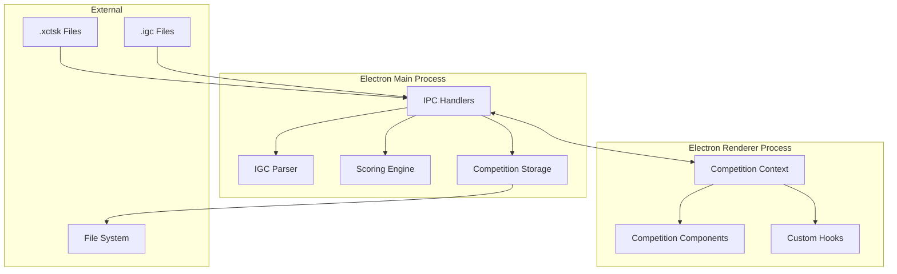
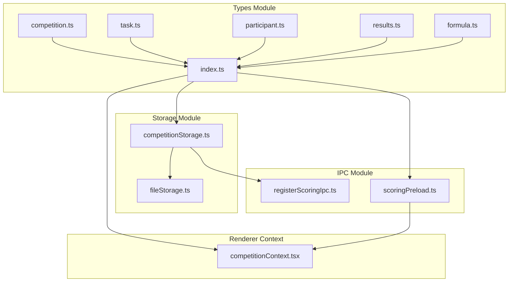
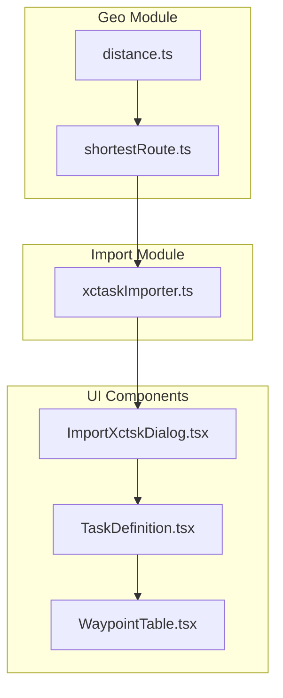
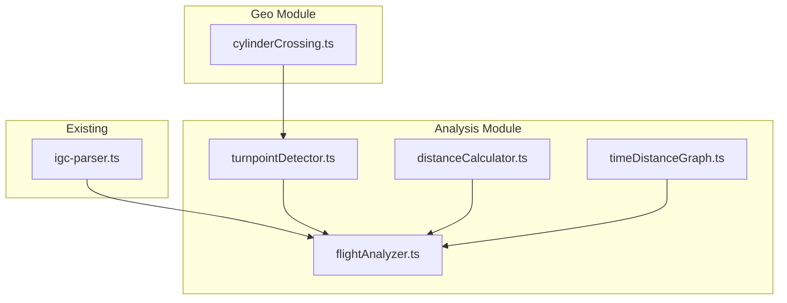
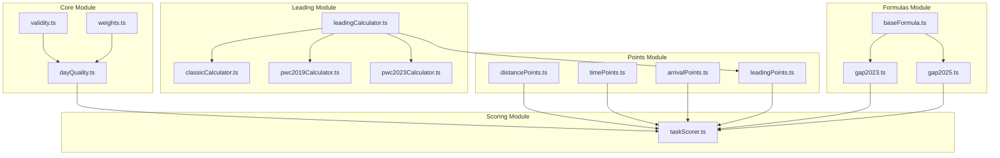
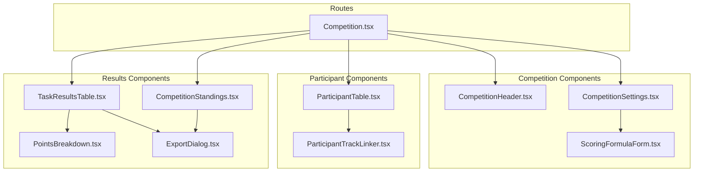
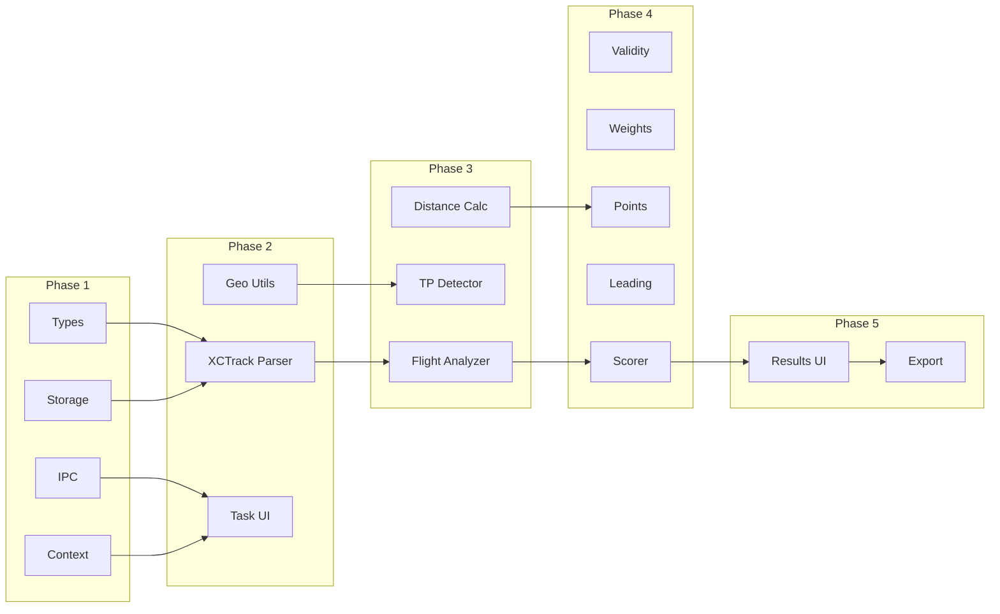

# Dependency Graph

This document visualizes the module dependencies for the competition classification system.

## High-Level Architecture



## Detailed Module Dependencies

### Phase 1: Foundation



### Phase 2: Task Import



### Phase 3: Flight Analysis



### Phase 4: Scoring Engine



### Phase 5: Results & UI



## Cross-Phase Dependencies



## File System Structure

```
src/main/scoring/
├── types/
│   ├── index.ts              # Re-exports all types
│   ├── competition.ts        # Core enums (TaskType, TaskStatus, etc.)
│   ├── task.ts               # Task, Turnpoint, StartGate
│   ├── participant.ts        # Participant, TaskParticipant
│   ├── results.ts            # TaskResult, CompetitionResult
│   └── formula.ts            # ScoringFormulaConfig, defaults
│
├── storage/
│   ├── competitionStorage.ts # Storage interface
│   └── fileStorage.ts        # File-based implementation
│
├── import/
│   └── xctaskImporter.ts     # XCTrack .xctsk parser
│
├── geo/
│   ├── distance.ts           # Haversine, WGS84 Andoyer
│   ├── shortestRoute.ts      # Route optimization
│   └── cylinderCrossing.ts   # Cylinder intersection
│
├── analysis/
│   ├── flightAnalyzer.ts     # Main flight analysis
│   ├── turnpointDetector.ts  # TP crossing detection
│   ├── distanceCalculator.ts # Distance calculations
│   └── timeDistanceGraph.ts  # Time-dist graph for LC
│
├── formulas/
│   ├── index.ts              # Formula registry
│   ├── baseFormula.ts        # Shared logic
│   ├── gap2023.ts            # GAP2023 specifics
│   └── gap2025.ts            # GAP2025 specifics
│
├── core/
│   ├── validity.ts           # TV, LV, DV, SV
│   ├── weights.ts            # Weight distribution
│   └── dayQuality.ts         # Day quality calculation
│
├── points/
│   ├── distancePoints.ts     # Distance scoring
│   ├── timePoints.ts         # Time scoring
│   ├── arrivalPoints.ts      # Arrival scoring
│   └── leadingPoints.ts      # Leading/departure scoring
│
├── leading/
│   ├── leadingCalculator.ts  # Base interface
│   ├── classicCalculator.ts  # Classic LC
│   ├── pwc2019Calculator.ts  # PWC 2019 LC
│   └── pwc2023Calculator.ts  # PWC 2023 LC
│
├── scoring/
│   └── taskScorer.ts         # Main scoring orchestrator
│
└── ipc/
    ├── registerScoringIpc.ts # IPC handlers
    └── scoringPreload.ts     # Preload bridge
```

## Integration Points

### With Existing Trackdownloader Code

| New Module | Integrates With | Purpose |
|------------|-----------------|---------|
| `competitionContext.tsx` | `settingsContext.tsx` | Access pilot data |
| `flightAnalyzer.ts` | `igc-parser.ts` | Parse IGC files |
| `registerScoringIpc.ts` | `registerTracksIpc.ts` | Follow IPC pattern |
| `scoringPreload.ts` | `tracksPreload.ts` | Follow preload pattern |
| Competition route | `Home.tsx` | Navigation integration |

### With FS Codebase

| New Module | FS Source File | Lines |
|------------|----------------|-------|
| `validity.ts` | `GAP.cs` | 187-267 |
| `weights.ts` | `GAP.cs` | 508-594 |
| `distancePoints.ts` | `GAP.cs` | 1074-1103, 1237-1257 |
| `timePoints.ts` | `GAP.cs` | 1159-1173 |
| `leadingPoints.ts` | `GAP.cs` | 967-993 |
| `turnpointDetector.ts` | `Flight.cs` | 423-650 |
| `distanceCalculator.ts` | `Flight.cs` | 910-1122 |
| `pwc2023Calculator.ts` | `LeadingCalculatorPwc2023.cs` | All |
