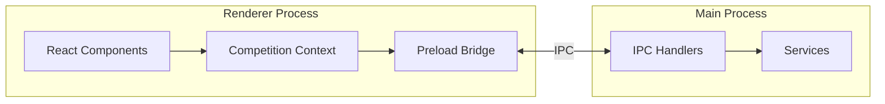

# IPC Channels

This document describes the Electron IPC (Inter-Process Communication) channels for the competition classification system.

## Architecture Overview



## Channel Naming Convention

All competition-related channels follow this pattern:
```
scoring:{action}
```

Examples:
- `scoring:create-competition`
- `scoring:import-xctsk`
- `scoring:score-task`

## Channel Reference

### Competition Management

| Channel | Direction | Parameters | Returns |
|---------|-----------|------------|---------|
| `scoring:list-competitions` | Renderer → Main | None | `CompetitionSummary[]` |
| `scoring:create-competition` | Renderer → Main | `CreateCompetitionData` | `string` (id) |
| `scoring:get-competition` | Renderer → Main | `string` (id) | `Competition` |
| `scoring:update-competition` | Renderer → Main | `{ id, updates }` | `void` |
| `scoring:delete-competition` | Renderer → Main | `string` (id) | `void` |
| `scoring:load-competition` | Renderer → Main | `string` (path) | `Competition` |
| `scoring:save-competition` | Renderer → Main | `{ path, data }` | `void` |

### Task Management

| Channel | Direction | Parameters | Returns |
|---------|-----------|------------|---------|
| `scoring:import-xctsk` | Renderer → Main | `string` (path) | `TaskDefinition` |
| `scoring:add-task` | Renderer → Main | `{ compId, task }` | `void` |
| `scoring:update-task` | Renderer → Main | `{ compId, taskId, updates }` | `void` |
| `scoring:delete-task` | Renderer → Main | `{ compId, taskId }` | `void` |

### Flight Analysis

| Channel | Direction | Parameters | Returns |
|---------|-----------|------------|---------|
| `scoring:analyze-flight` | Renderer → Main | `{ compId, taskId, igcPath }` | `FlightAnalysis` |
| `scoring:batch-analyze` | Renderer → Main | `{ compId, taskId, igcPaths[] }` | `FlightAnalysis[]` |

### Scoring

| Channel | Direction | Parameters | Returns |
|---------|-----------|------------|---------|
| `scoring:score-task` | Renderer → Main | `{ compId, taskId }` | `TaskResult[]` |
| `scoring:score-competition` | Renderer → Main | `string` (compId) | `CompetitionResult[]` |
| `scoring:scoring-progress` | Main → Renderer | `{ percent, detail }` | N/A (event) |

### Export

| Channel | Direction | Parameters | Returns |
|---------|-----------|------------|---------|
| `scoring:export-task-results` | Renderer → Main | `{ taskId, format }` | `string` (path) |
| `scoring:export-competition` | Renderer → Main | `{ compId, format }` | `string` (path) |

### File Dialogs

| Channel | Direction | Parameters | Returns |
|---------|-----------|------------|---------|
| `scoring:select-file` | Renderer → Main | `{ type }` | `string` (path) |
| `scoring:save-dialog` | Renderer → Main | `{ type, defaultPath }` | `string` (path) |

## Implementation

### Main Process Handler Registration

```typescript
// src/main/scoring/ipc/registerScoringIpc.ts

import { BrowserWindow, dialog, ipcMain } from "electron";
import { parseXctskFile } from "../import/xctaskImporter";
import { scoreTask } from "../scoring/taskScorer";
import { CompetitionStorage } from "../storage/competitionStorage";

export default function registerScoringIpc(appWindow: BrowserWindow) {
  const storage = new CompetitionStorage();

  // Competition CRUD
  ipcMain.handle("scoring:list-competitions", async () => {
    return storage.listCompetitions();
  });

  ipcMain.handle("scoring:create-competition", async (_, data) => {
    return storage.createCompetition(data);
  });

  ipcMain.handle("scoring:get-competition", async (_, id) => {
    return storage.getCompetition(id);
  });

  ipcMain.handle("scoring:update-competition", async (_, { id, updates }) => {
    return storage.updateCompetition(id, updates);
  });

  ipcMain.handle("scoring:delete-competition", async (_, id) => {
    return storage.deleteCompetition(id);
  });

  // Task import
  ipcMain.handle("scoring:import-xctsk", async (_, filePath) => {
    return parseXctskFile(filePath);
  });

  ipcMain.handle("scoring:add-task", async (_, { compId, task }) => {
    return storage.addTask(compId, task);
  });

  // Flight analysis
  ipcMain.handle("scoring:analyze-flight", async (_, { compId, taskId, igcPath }) => {
    const task = await storage.getTask(compId, taskId);
    return analyzeFlightForTask(igcPath, task);
  });

  ipcMain.handle("scoring:batch-analyze", async (event, { compId, taskId, igcPaths }) => {
    const task = await storage.getTask(compId, taskId);
    const results: FlightAnalysis[] = [];

    for (let i = 0; i < igcPaths.length; i++) {
      // Send progress to renderer
      event.sender.send("scoring:scoring-progress", {
        percent: Math.round((i / igcPaths.length) * 100),
        detail: `Analyzing flight ${i + 1} of ${igcPaths.length}`
      });

      const analysis = await analyzeFlightForTask(igcPaths[i], task);
      results.push(analysis);
    }

    return results;
  });

  // Scoring
  ipcMain.handle("scoring:score-task", async (event, { compId, taskId }) => {
    const onProgress = (percent: number, detail: string) => {
      event.sender.send("scoring:scoring-progress", { percent, detail });
    };

    const task = await storage.getTask(compId, taskId);
    const participants = await storage.getTaskParticipants(compId, taskId);
    const formula = await storage.getScoringFormula(compId);

    const results = await scoreTask({ task, participants, formula }, onProgress);
    await storage.saveTaskResults(compId, taskId, results);

    return results;
  });

  ipcMain.handle("scoring:score-competition", async (event, compId) => {
    const onProgress = (percent: number, detail: string) => {
      event.sender.send("scoring:scoring-progress", { percent, detail });
    };

    const competition = await storage.getCompetition(compId);
    const results = await scoreCompetition(competition, onProgress);
    await storage.saveCompetitionResults(compId, results);

    return results;
  });

  // File dialogs
  ipcMain.handle("scoring:select-file", async (_, { type }) => {
    const filters: Record<string, Electron.FileFilter[]> = {
      xctsk: [{ name: "XCTrack Task", extensions: ["xctsk"] }],
      competition: [{ name: "Competition", extensions: ["json", "fscomp"] }],
      igc: [{ name: "IGC Track", extensions: ["igc"] }],
    };

    const result = await dialog.showOpenDialog(appWindow, {
      properties: ["openFile"],
      filters: filters[type] || [],
    });

    if (result.canceled || result.filePaths.length === 0) {
      throw new Error("No file selected");
    }

    return result.filePaths[0];
  });

  ipcMain.handle("scoring:save-dialog", async (_, { type, defaultPath }) => {
    const filters: Record<string, Electron.FileFilter[]> = {
      competition: [{ name: "Competition", extensions: ["json"] }],
      csv: [{ name: "CSV", extensions: ["csv"] }],
      html: [{ name: "HTML", extensions: ["html"] }],
      fsdb: [{ name: "FSDB", extensions: ["fsdb"] }],
    };

    const result = await dialog.showSaveDialog(appWindow, {
      defaultPath,
      filters: filters[type] || [],
    });

    if (result.canceled || !result.filePath) {
      throw new Error("No file selected");
    }

    return result.filePath;
  });

  // Export
  ipcMain.handle("scoring:export-task-results", async (_, { compId, taskId, format }) => {
    const results = await storage.getTaskResults(compId, taskId);
    const participants = await storage.getParticipants(compId);
    const task = await storage.getTask(compId, taskId);

    const filePath = await exportResults({ results, participants, task, format });
    return filePath;
  });
}
```

### Preload Script

```typescript
// src/main/scoring/ipc/scoringPreload.ts

import { contextBridge, ipcRenderer } from "electron";

export interface ScoringMethods {
  // Competition management
  listCompetitions: () => Promise<CompetitionSummary[]>;
  createCompetition: (data: CreateCompetitionData) => Promise<string>;
  getCompetition: (id: string) => Promise<Competition>;
  updateCompetition: (id: string, updates: Partial<Competition>) => Promise<void>;
  deleteCompetition: (id: string) => Promise<void>;
  loadCompetition: (path: string) => Promise<Competition>;
  saveCompetition: (path: string, data: Competition) => Promise<void>;

  // Task management
  importXctsk: (path: string) => Promise<TaskDefinition>;
  addTask: (compId: string, task: TaskDefinition) => Promise<void>;
  updateTask: (compId: string, taskId: string, updates: Partial<TaskDefinition>) => Promise<void>;
  deleteTask: (compId: string, taskId: string) => Promise<void>;

  // Flight analysis
  analyzeFlight: (compId: string, taskId: string, igcPath: string) => Promise<FlightAnalysis>;
  batchAnalyze: (compId: string, taskId: string, igcPaths: string[]) => Promise<FlightAnalysis[]>;

  // Scoring
  scoreTask: (compId: string, taskId: string) => Promise<TaskResult[]>;
  scoreCompetition: (compId: string) => Promise<CompetitionResult[]>;

  // Export
  exportTaskResults: (compId: string, taskId: string, format: ExportFormat) => Promise<string>;
  exportCompetition: (compId: string, format: ExportFormat) => Promise<string>;

  // File dialogs
  selectFile: (type: FileType) => Promise<string>;
  saveDialog: (type: FileType, defaultPath?: string) => Promise<string>;

  // Progress events
  onScoringProgress: (callback: (data: ProgressData) => void) => void;
  removeScoringProgressListener: () => void;
}

const scoring: ScoringMethods = {
  // Competition management
  listCompetitions: () =>
    ipcRenderer.invoke("scoring:list-competitions"),

  createCompetition: (data) =>
    ipcRenderer.invoke("scoring:create-competition", data),

  getCompetition: (id) =>
    ipcRenderer.invoke("scoring:get-competition", id),

  updateCompetition: (id, updates) =>
    ipcRenderer.invoke("scoring:update-competition", { id, updates }),

  deleteCompetition: (id) =>
    ipcRenderer.invoke("scoring:delete-competition", id),

  loadCompetition: (path) =>
    ipcRenderer.invoke("scoring:load-competition", path),

  saveCompetition: (path, data) =>
    ipcRenderer.invoke("scoring:save-competition", { path, data }),

  // Task management
  importXctsk: (path) =>
    ipcRenderer.invoke("scoring:import-xctsk", path),

  addTask: (compId, task) =>
    ipcRenderer.invoke("scoring:add-task", { compId, task }),

  updateTask: (compId, taskId, updates) =>
    ipcRenderer.invoke("scoring:update-task", { compId, taskId, updates }),

  deleteTask: (compId, taskId) =>
    ipcRenderer.invoke("scoring:delete-task", { compId, taskId }),

  // Flight analysis
  analyzeFlight: (compId, taskId, igcPath) =>
    ipcRenderer.invoke("scoring:analyze-flight", { compId, taskId, igcPath }),

  batchAnalyze: (compId, taskId, igcPaths) =>
    ipcRenderer.invoke("scoring:batch-analyze", { compId, taskId, igcPaths }),

  // Scoring
  scoreTask: (compId, taskId) =>
    ipcRenderer.invoke("scoring:score-task", { compId, taskId }),

  scoreCompetition: (compId) =>
    ipcRenderer.invoke("scoring:score-competition", compId),

  // Export
  exportTaskResults: (compId, taskId, format) =>
    ipcRenderer.invoke("scoring:export-task-results", { compId, taskId, format }),

  exportCompetition: (compId, format) =>
    ipcRenderer.invoke("scoring:export-competition", { compId, format }),

  // File dialogs
  selectFile: (type) =>
    ipcRenderer.invoke("scoring:select-file", { type }),

  saveDialog: (type, defaultPath) =>
    ipcRenderer.invoke("scoring:save-dialog", { type, defaultPath }),

  // Progress events
  onScoringProgress: (callback) => {
    ipcRenderer.on("scoring:scoring-progress", (_, data) => callback(data));
  },

  removeScoringProgressListener: () => {
    ipcRenderer.removeAllListeners("scoring:scoring-progress");
  },
};

contextBridge.exposeInMainWorld("scoring", scoring);
```

### Global Type Declaration

```typescript
// src/typings/global.d.ts (extend existing)

import type { ScoringMethods } from "../main/scoring/ipc/scoringPreload";

declare global {
  interface Window {
    // Existing
    app: AppMethods;
    tracks: TrackMethods;
    scrappers: ScrapperMethods;

    // New
    scoring: ScoringMethods;
  }
}
```

### Registration in Main App

```typescript
// src/main/appWindow.ts (modify existing)

import registerScoringIpc from "./scoring/ipc/registerScoringIpc";

export async function createAppWindow(
  icon?: string
): Promise<Electron.BrowserWindow> {
  const appWindow = new BrowserWindow({
    // ... existing options
    webPreferences: {
      preload: MAIN_WINDOW_PRELOAD_WEBPACK_ENTRY,
      // ... existing options
    },
  });

  // Existing IPC registrations
  registerTitlebarIpc(appWindow);
  registerTracksIpc(appWindow);
  registerScrappersIpc(appWindow);

  // New scoring IPC registration
  registerScoringIpc(appWindow);

  // ... rest of function
}
```

### Preload Entry Update

```typescript
// src/main/scoring/ipc/index.ts

// Re-export for preload bundling
export * from "./scoringPreload";
```

## Usage in React Components

```typescript
// Example: Task Import Dialog

import React, { useState } from "react";

const TaskImportDialog: React.FC = () => {
  const [isLoading, setIsLoading] = useState(false);
  const [task, setTask] = useState<TaskDefinition | null>(null);
  const [error, setError] = useState<string | null>(null);

  const handleSelectFile = async () => {
    try {
      setIsLoading(true);
      setError(null);

      // Use IPC to open file dialog
      const filePath = await window.scoring.selectFile("xctsk");

      // Use IPC to parse task file
      const parsedTask = await window.scoring.importXctsk(filePath);
      setTask(parsedTask);
    } catch (err) {
      setError(err.message);
    } finally {
      setIsLoading(false);
    }
  };

  const handleConfirm = async () => {
    if (!task) return;

    try {
      await window.scoring.addTask(competitionId, task);
      onClose();
    } catch (err) {
      setError(err.message);
    }
  };

  return (
    <div>
      <button onClick={handleSelectFile} disabled={isLoading}>
        Select .xctsk File
      </button>
      {error && <div className="text-red-500">{error}</div>}
      {task && <TaskPreview task={task} />}
      <button onClick={handleConfirm} disabled={!task}>
        Import Task
      </button>
    </div>
  );
};
```

## Progress Handling

```typescript
// Example: Scoring with Progress

import React, { useState, useEffect } from "react";

const ScoringButton: React.FC<{ taskId: string }> = ({ taskId }) => {
  const [isScoring, setIsScoring] = useState(false);
  const [progress, setProgress] = useState({ percent: 0, detail: "" });

  useEffect(() => {
    // Listen for progress updates
    window.scoring.onScoringProgress((data) => {
      setProgress(data);
    });

    // Cleanup listener on unmount
    return () => {
      window.scoring.removeScoringProgressListener();
    };
  }, []);

  const handleScore = async () => {
    setIsScoring(true);
    try {
      await window.scoring.scoreTask(competitionId, taskId);
    } finally {
      setIsScoring(false);
    }
  };

  return (
    <div>
      <button onClick={handleScore} disabled={isScoring}>
        Score Task
      </button>
      {isScoring && (
        <div>
          <div>{progress.percent}%</div>
          <div>{progress.detail}</div>
        </div>
      )}
    </div>
  );
};
```

## Error Handling

All IPC handlers should follow this error handling pattern:

```typescript
ipcMain.handle("scoring:some-operation", async (_, params) => {
  try {
    // Perform operation
    return await someOperation(params);
  } catch (error) {
    // Log error for debugging
    console.error("scoring:some-operation error:", error);

    // Re-throw with clean message for UI
    throw new Error(
      error instanceof Error
        ? error.message
        : "An unknown error occurred"
    );
  }
});
```

Renderer-side error handling:

```typescript
try {
  await window.scoring.someOperation(params);
} catch (error) {
  // error.message contains the clean error message
  setErrorState(error.message);
}
```
