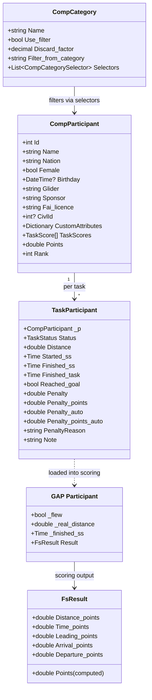
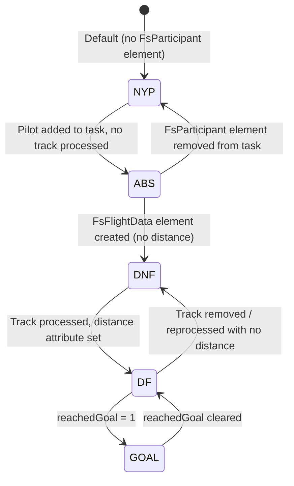

# FS Participant Management

How FlightScoring (FS) manages participants at competition and task levels, and how our trackdownloader types map to them.

## Data Model



## Competition-Level Participants

`CompParticipant` (`FsFsdb/CompParticipant.cs`) stores profile data only. There is **no active/withdrawn status** at the competition level — participants either exist in the FSDB XML or they don't.

**Key fields:** id, name, nation (IOC code), female, birthday, glider, sponsor, fai_licence, CivlId, custom attributes.

### Categories

`CompCategory` filters participants into sub-rankings using attribute selectors:

```xml
<FsCompCategory name="Women" use_filter="True" filter_from="Overall" ftv_factor="0.25">
  <FsCompCategorySelectors>
    <FsCompCategorySelector attr="female" expression="1" />
  </FsCompCategorySelectors>
</FsCompCategory>
```

- `use_filter=True` + `filter_from` = subset of another category's results
- `ftv_factor` = FTV discard factor (0 = count all tasks, 0.25 = discard 25% of worst scores)

## Task-Level Participants — TaskStatus

`TaskParticipant` (`FsFsdb/TaskParticipant.cs`) wraps per-task state with a `TaskStatus` enum:

```csharp
public enum TaskStatus { ABS = 0, DNF = 1, NYP = 2, DF = 3, GOAL = 4 };
```

| Status | Value | Meaning | Has FsFlightData? | Has distance? | In scoring? |
|--------|-------|---------|-------------------|---------------|-------------|
| **NYP** | 2 | Not Yet Processed | No | No | No |
| **ABS** | 0 | Absent — registered but didn't show | No (element exists, no child) | No | No — completely skipped |
| **DNF** | 1 | Did Not Fly — present but no flight | Yes | No | Yes, `_flew=false` → 0 pts |
| **DF** | 3 | Did Fly — flew but didn't reach goal | Yes | Yes | Yes — dist + leading pts |
| **GOAL** | 4 | Reached Goal — completed the task | Yes | Yes, `reachedGoal=1` | Yes — all point components |

### Status Inference from FSDB XML

Status is **not stored explicitly** — it's inferred from element structure:

```
Start: NYP (default)
  └─ Has FsParticipant element in task? → ABS
       └─ Has FsFlightData child element? → DNF
            └─ Has distance attribute? → DF
                 └─ reachedGoal = 1? → GOAL
```

**Important**: ABS ≠ "no entry". ABS means the pilot has an `FsParticipant` element inside the task but with no `FsFlightData` child. No `FsParticipant` element at all = NYP.

### Status Lifecycle



## FSDB XML Structure

### Competition participants
```xml
<FsCompetition>
  <FsParticipants>
    <FsParticipant id="123" name="John Doe" nat_code_ioc="ESP"
                   female="0" birthday="1990-01-15"
                   glider="Ozone Enzo 3" sponsor="ACME"
                   fai_licence="1" CIVLID="12345">
      <FsCustomAttributes>
        <FsCustomAttribute name="team" value="Spain A" />
      </FsCustomAttributes>
    </FsParticipant>
  </FsParticipants>
</FsCompetition>
```

### Task participants — all statuses
```xml
<FsTask>
  <FsParticipants>
    <!-- NYP: no FsParticipant element at all for this pilot -->

    <!-- ABS: element exists, no FsFlightData child -->
    <FsParticipant id="101" />

    <!-- DNF: has FsFlightData, no distance attribute -->
    <FsParticipant id="102">
      <FsFlightData />
    </FsParticipant>

    <!-- DF: has FsFlightData with distance -->
    <FsParticipant id="103">
      <FsFlightData distance="45230" tracklog_filename="103.igc"
                    started_ss="12:30:00" max_alt="2150" />
    </FsParticipant>

    <!-- GOAL: has FsFlightData with distance and reachedGoal=1 -->
    <FsParticipant id="104">
      <FsFlightData distance="78500" tracklog_filename="104.igc"
                    started_ss="12:30:00" finished_ss="14:15:30"
                    finished_task="14:16:00" reachedGoal="1"
                    altitude_at_ess="1850" max_alt="2500" />
    </FsParticipant>
  </FsParticipants>
</FsTask>
```

## Scoring Exclusion Rules

### XPath Selection (GAP.cs:1316)

```csharp
XmlNodeList xnl_pfds = xe_t.SelectNodes("FsParticipants/FsParticipant/FsFlightData");
```

This XPath selects only elements that have `FsFlightData` children, which means:
- **ABS pilots** (no `FsFlightData`) are **never loaded** into the scoring array
- **DNF pilots** (have `FsFlightData` but no distance) are loaded with `_flew = false`
- **DF/GOAL pilots** are loaded with `_flew = true`

### The `_flew` Flag (GAP Participant)

```csharp
// GAP.cs line 1328-1331
if (xe_pfd.HasAttribute(task_dist_attr_name))  // DF
{
    p._flew = true;
    // ... parse distance, times, goal status
}
// If no distance attribute, _flew remains false (DNF)
```

**`_flew` gates all task statistics:**
- `No_of_pilots_flying` — only `_flew` pilots
- `No_of_pilots_LO` — only `_flew` pilots who didn't reach task distance
- `No_of_pilots_reaching_ES` — only `_flew` with `finished_ss`
- `No_of_pilots_reaching_goal` — only `_flew` with `real_distance >= task_distance`

DNF pilots are in the scoring array but contribute nothing to statistics and receive 0 points.

### Competition Standings — `flewOneTask`

```csharp
// GAP.cs lines 2047-2077
bool flewOneTask = false;
for (int j = 0; j < task_ids.Length; j++)
{
    // ... load task scores
    if (!cp_attrs.ContainsKey("no_distance"))
    {
        flewOneTask = true;
    }
}
if (flewOneTask)
{
    cps.Add(cp);  // Only appears in competition standings
}
```

A pilot must have at least one task where `no_distance` is NOT set (i.e., they flew at least once) to appear in competition results. Pure DNF/ABS-only pilots are excluded from standings.

## Penalty System

### Penalty Types

| Type | Field | Source | Applied to |
|------|-------|--------|------------|
| **Auto (JTG)** | `penalty_points_auto` | `FsResult` attributes | Jump-the-gun penalties |
| **Manual fraction** | `penalty` | `FsResultPenalty` element | 0-1 fraction of remaining score |
| **Manual points** | `penalty_points` | `FsResultPenalty` element | Absolute point deduction |

### Application Order (FsResult.cs Points getter)

```csharp
// FsResult.cs lines 112-147
public double Points
{
    get
    {
        // 1. Sum raw component scores
        double points = Arrival_points + Departure_points
            + DistanceBreakdown.Distance_points
            + Leading_points + Time_points;

        // 2. Apply auto penalties (JTG) with minimum distance floor
        if (_penalty_points_auto != 0)
        {
            points -= _penalty_points_auto;
            if (points < _penalty_min_dist_points)
                points = _penalty_min_dist_points;
        }

        // 3. Apply manual penalties on remaining score
        double penalties = 0;
        if (_penalty != 0) penalties += points * _penalty;       // fraction
        if (_penalty_points != 0) penalties += _penalty_points;  // absolute
        points -= penalties;

        // 4. Floor at 0
        if (points < 0) points = 0;

        // 5. Cap at 1000, round
        points = Math.Min(1000.0, Math.Round(points,
            _number_of_decimals_task_results,
            MidpointRounding.AwayFromZero));

        return points;
    }
}
```

**Key behaviors:**
1. Auto penalties (jump-the-gun) applied first, with a **floor** at minimum distance points — pilot always gets at least min-dist score
2. Manual penalties applied to the **remaining** score after auto penalties
3. Fraction penalty is multiplicative: `remaining * fraction`
4. Absolute penalty is additive: `remaining - points`
5. Both manual types can combine
6. Final result floored at 0, capped at 1000

### 100% Penalty Edge Case

A pilot with 100% penalty (`penalty=1.0`) gets 0 points but **still appears in results**. This is different from ABS, where the pilot is completely absent from task scoring. The `note_for_winners_with_penalty` constant handles a special case where a task winner has 100% penalty.

### FSDB Penalty XML

```xml
<FsParticipant id="103">
  <FsFlightData distance="45230" ... />
  <FsResultPenalty penalty="0.1" penalty_points="0"
                   penalty_reason="Late start gate crossing" />
  <FsResult penalty_auto="0" penalty_points_auto="50"
            penalty_reason_auto="Jump the gun: 3 seconds" ... />
</FsParticipant>
```

## Mapping to Trackdownloader Types

### Competition Level

| FS (C#) | Trackdownloader (TS) | Notes |
|---------|---------------------|-------|
| `CompParticipant.Id` | `Participant.id` | |
| `CompParticipant.Name` | `Participant.name` | |
| `CompParticipant.Nation` | `Participant.nation` | FS uses IOC codes |
| `CompParticipant.Female` | `Participant.genre` | FS: bool, ours: "MALE"/"FEMALE" |
| `CompParticipant.Glider` | `Participant.glider` | |
| `CompParticipant.Sponsor` | `Participant.sponsor` | |
| `CompParticipant.Fai_licence` | `Participant.faiId` | |
| `CompParticipant.CivlId` | — | Not mapped |
| `CompParticipant.CustomAttributes` | — | Not mapped |
| — (no status field) | `Participant.status` | We added: Confirmed/Waiting/Cancelled/Withdrawn |

### Task Level

| FS (C#) | Trackdownloader (TS) | Notes |
|---------|---------------------|-------|
| `TaskParticipant.Status` | `TaskParticipant.status` | Same values: ABS/DNF/NYP/DF/GOAL |
| `TaskParticipant.Distance` | `TaskParticipant.distance` | |
| `TaskParticipant.Started_ss` | `TaskParticipant.timing.startedSS` | FS: Time, ours: Unix timestamp ms |
| `TaskParticipant.Finished_ss` | `TaskParticipant.timing.finishedSS` | |
| `TaskParticipant.Finished_task` | `TaskParticipant.timing.finishedTask` | |
| `TaskParticipant.Reached_goal` | `TaskParticipant.reachedGoal` | |
| `TaskParticipant.Max_Altitude` | `TaskParticipant.altitudes.maxAltitude` | |
| `TaskParticipant.ESS_Altitude` | `TaskParticipant.altitudes.essAltitude` | |
| `TaskParticipant.Penalty` | `TaskParticipant.penalties.manual[].points` | FS: single fraction, ours: array |
| `TaskParticipant.Penalty_points` | `TaskParticipant.penalties.manual[].points` | FS: single value, ours: array |
| `TaskParticipant.Penalty_auto` | `TaskParticipant.penalties.auto[].points` | |
| `TaskParticipant.Note` | `TaskParticipant.notes` | |

### Key Differences

1. **Competition-level status**: FS has none; we have `ParticipantStatus` (Confirmed/Waiting/Cancelled/Withdrawn)
2. **Penalties**: FS stores a single manual penalty (fraction + points); we support an array of typed penalties
3. **Time representation**: FS uses `Time` objects; we use Unix timestamps in milliseconds
4. **Gender**: FS uses `bool Female`; we use `string genre` ("MALE"/"FEMALE")
5. **Track data**: FS stores `tracklog_filename`; we have `TaskTrack` with igcPath + status
